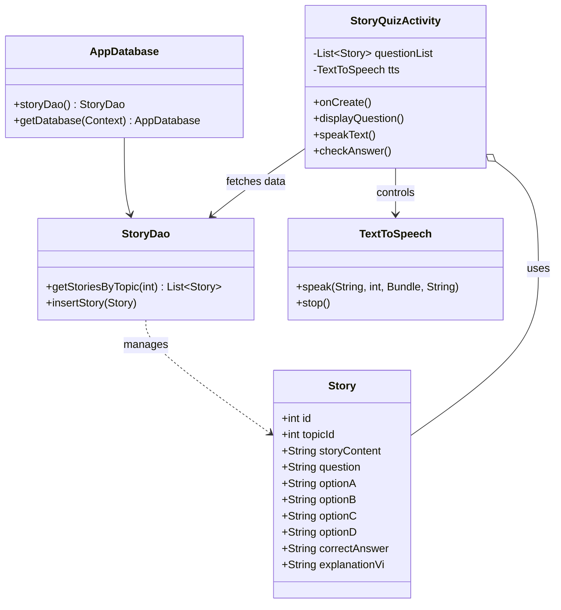
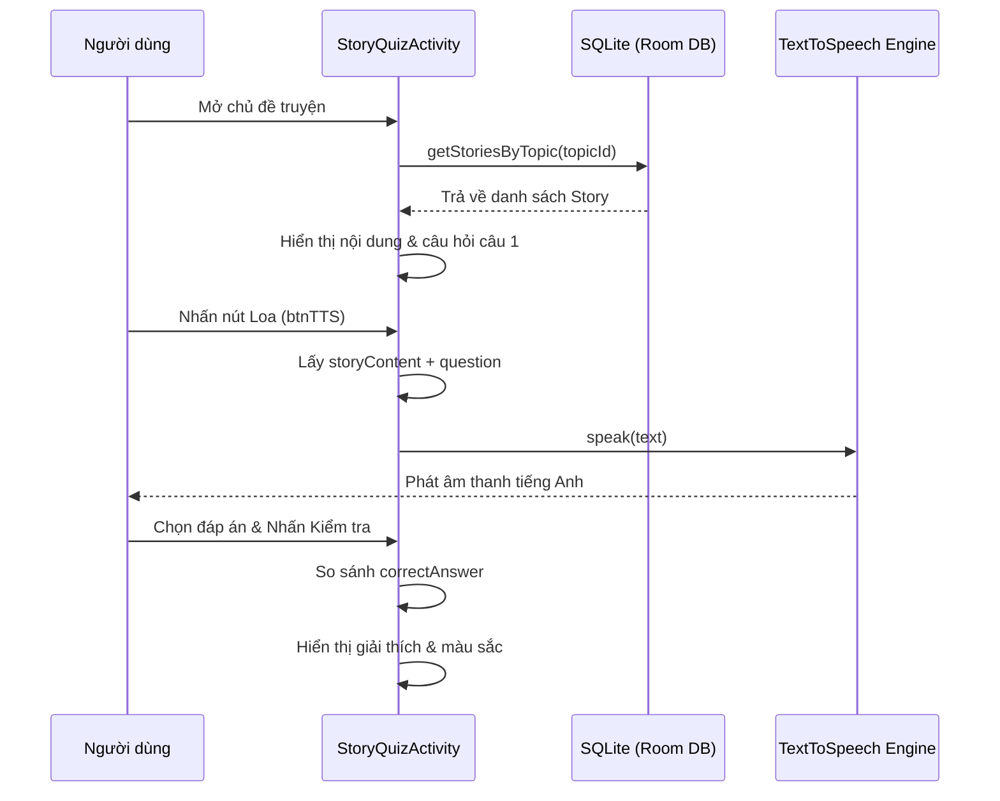
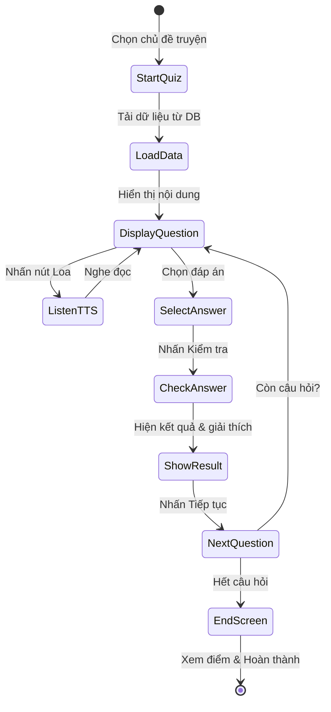

# TÀI LIỆU SƠ ĐỒ HỆ THỐNG WORDPULSE

Tài liệu này cung cấp các sơ đồ UML (dưới định dạng Mermaid) mô tả cấu trúc và hoạt động của ứng dụng WordPulse, tập trung vào tổng quan hệ thống và chức năng **Đọc Truyện & Nội Dung**.

---

## 1. Sơ đồ Use Case (Use Case Diagram) - Tổng quan toàn hệ thống

Sơ đồ này mô tả chi tiết tất cả các chức năng mà người dùng có thể tương tác trong hệ thống WordPulse.

```mermaid
useCaseDiagram
    actor "Người dùng" as User
    
    package "Hệ thống WordPulse" {
        %% Nhóm chức năng chính
        usecase "Quản lý chủ đề học tập" as UC_Topic
        usecase "Học Flashcards (Từ vựng)" as UC_Flashcard
        usecase "Luyện nghe (Listening)" as UC_Listen
        usecase "Luyện ngữ pháp (Grammar)" as UC_Grammar
        usecase "Đọc truyện & Hiểu bài (Story)" as UC_Story
        
        %% Nhóm chức năng chi tiết trong Story
        usecase "Nghe đọc nội dung (TTS)" as UC_TTS
        usecase "Làm bài trắc nghiệm hiểu bài" as UC_Quiz
        
        %% Nhóm kết quả
        usecase "Xem kết quả & Đánh giá" as UC_Result
        usecase "Theo dõi tiến độ học tập" as UC_Progress
    }

    User --> UC_Topic
    User --> UC_Flashcard
    User --> UC_Listen
    User --> UC_Grammar
    User --> UC_Story
    
    %% Mối quan hệ giữa các Use Case
    UC_Story <.. UC_TTS : <<extend>>
    UC_Story ..> UC_Quiz : <<include>>
    
    UC_Quiz ..> UC_Result : <<include>>
    UC_Flashcard ..> UC_Progress : <<include>>
    UC_Listen ..> UC_Result : <<include>>
    UC_Grammar ..> UC_Result : <<include>>
```

---

## 2. Sơ đồ Lớp (Class Diagram)

Sơ đồ này mô tả cấu trúc dữ liệu và mối quan hệ giữa các thành phần trong chức năng Đọc Truyện.



---

## 3. Sơ đồ Tuần tự (Sequence Diagram) - Chức năng Đọc Truyện & TTS

Sơ đồ mô tả trình tự tương tác khi người dùng chọn một câu chuyện và yêu cầu nghe đọc nội dung.



---

## 4. Sơ đồ Hoạt động (Activity Diagram)

Sơ đồ mô tả luồng xử lý từ lúc bắt đầu đọc truyện đến khi hoàn thành bài thi.



---

## 5. Tổng kết chức năng "Đọc Truyện & Nội dung"

- **Mục tiêu:** Cải thiện kỹ năng đọc hiểu và phát âm thông qua ngữ cảnh.
- **Công nghệ chính:**
    - **Room Persistence:** Lưu trữ và quản lý kho truyện, câu hỏi.
    - **Text-To-Speech (TTS):** Chuyển đổi văn bản sang giọng nói tự động.
    - **Material Design:** Cung cấp trải nghiệm người dùng hiện đại với CardView và hiệu ứng gradient.
